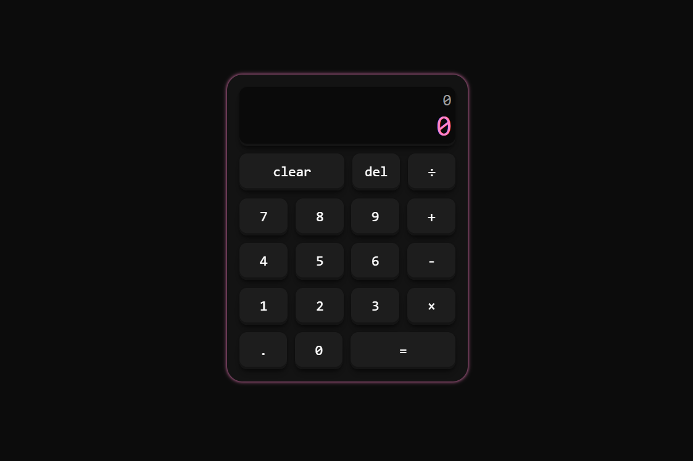

# Calculator

A simple calculator built with **HTML, CSS, and JavaScript** as part of **The Odin Project** Foundations curriculum.

This project helped me practice DOM manipulation, event listeners, functions, and state management by building a calculator without using JavaScript's `eval()` function.

## Features

- Perform addition, subtraction, multiplication, and division.
- Supports multi-digit numbers.
- Chained calculations (e.g. `2 + 3 + 4 = 9`).
- Replace an operator before entering the second number.
- Delete the last entered digit or operator.
- All Clear (AC) button to reset the calculator.
- Prevents division by zero by displaying an error.
- Responsive button interactions with hover and active effects.
- Keeps track of the previous calculation in a secondary display.

## Built With

- HTML5
- CSS3
- JavaScript (Vanilla)

## What I Learned

This project was much more than creating a calculator. It helped me understand how to manage the application's state without relying on `eval()`.

Some of the concepts I practiced include:

- DOM manipulation
- Event listeners
- JavaScript functions
- Conditional logic
- Managing application state
- String manipulation
- Handling edge cases and user input

One of the biggest lessons from this project was learning how to manage different pieces of state, such as the current numbers, the selected operator, and knowing when to reset the display after a calculation.

## Challenges

One of the most challenging parts was handling the calculator's logic while keeping track of its current state.

Some problems I solved included:

- Preventing multiple operators from being entered in a row.
- Supporting chained calculations.
- Making the Delete button remove the correct value.
- Starting a new calculation after pressing `=`.
- Keeping the display synchronized with the calculator's internal values.

Working through these challenges helped me better understand how interactive web applications manage data behind the scenes.

## Future Improvements

- Add decimal number support.
- Add keyboard support.
- Improve responsiveness for smaller screens.
- Format very large numbers more cleanly.
- Add calculation history.

## Preview

## Live Demo

🔗 **Live Site:** 
https://7pixiee.github.io/Calculator

---

This project was built as part of **The Odin Project** Foundations course to strengthen my understanding of JavaScript fundamentals and DOM manipulation.